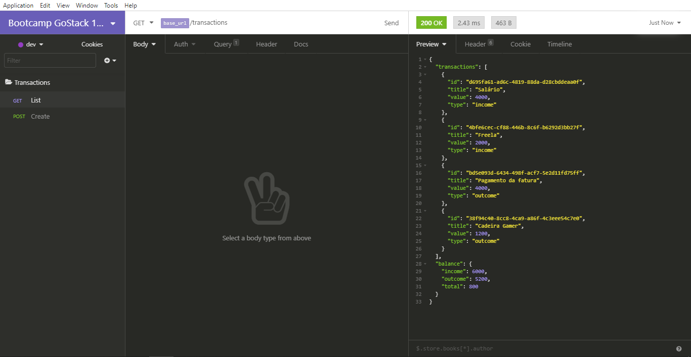

<h1 align="center">
  
</h1>

<h3 align="center">
  Desafio: Fundamentos do Node.js
</h3>

<p align="center">Essa será uma aplicação para armazenar transações financeiras de entrada e saída, que deve permitir o cadastro e a listagem dessas transações</p>

<p align="center">
  <a href="#como-executar-o-projeto">Como executar o projeto</a>&nbsp;&nbsp;&nbsp;|&nbsp;&nbsp;&nbsp;
  <a href="#sobre-o-desafio">Sobre o Desafio</a>
</p>

<p align="center">Back-end</p>

<p align="center">
  
</p>

## Como executar o projeto

### Requisitos

- [Node.js](https://nodejs.org)
- [Yarn](https://yarnpkg.com)

### Opcional

- [Insomnia](https://insomnia.rest)

### Executar

- `git clone https://github.com/eliasmcastro/rocketseat-bootcamp-gostack-11.0-modulo-02-desafio-fundamentos-nodejs.git` para clonar este repositório
- `cd rocketseat-bootcamp-gostack-11.0-modulo-02-desafio-fundamentos-nodejs` para entrar na pasta do projeto
- `yarn` para instalar as dependências do projeto
- `yarn dev:server` para iniciar o servidor de desenvolvimento
- Acessar http://localhost:3333

_Dica: utilizar o Insomnia para testar as rotas_

- Abrir o Insomnia -> Application -> Preferences -> Data -> Import Data -> From File -> Selecionar o arquivo insomnia.json

### Testes automatizados

Para começar a utilizar os testes, execute o comando `yarn test`, e ele irá te retornar o resultado dos testes das rotas

_Dica: se utilizar o comando `yarn test --watchAll`, o mesmo fica realizando automaticamente os testes toda vez que o arquivo app.js é alterado_

## Sobre o desafio

### Rotas da aplicação

- **`POST /transactions`**: A rota deve receber `title`, `value` e `type` dentro do corpo da requisição, sendo `type` o tipo da transação, que deve ser `income` para entradas (depósitos) e `outcome` para saídas (retiradas). Ao cadastrar uma nova transação, ela deve ser armazenada dentro de um objeto com o seguinte formato :

```json
{
  "id": "uuid",
  "title": "Salário",
  "value": 3000,
  "type": "income"
}
```

- **`GET /transactions`**: Essa rota deve retornar uma listagem com todas as transações que você cadastrou até agora, junto com o valor de soma de entradas, retiradas e total de crédito. Essa rota deve retornar um objeto com o formato a seguir:

```json
{
  "transactions": [
    {
      "id": "uuid",
      "title": "Salário",
      "value": 4000,
      "type": "income"
    },
    {
      "id": "uuid",
      "title": "Freela",
      "value": 2000,
      "type": "income"
    },
    {
      "id": "uuid",
      "title": "Pagamento da fatura",
      "value": 4000,
      "type": "outcome"
    },
    {
      "id": "uuid",
      "title": "Cadeira Gamer",
      "value": 1200,
      "type": "outcome"
    }
  ],
  "balance": {
    "income": 6000,
    "outcome": 5200,
    "total": 800
  }
}
```

**Dica**: Dentro de balance, o income é a soma de todos os valores das transações com `type` income. O outcome é a soma de todos os valores das transações com `type` outcome, e o total é o valor de `income - outcome`.

**Dica 2**: Para fazer a soma dos valores, você pode usar a função [reduce](https://developer.mozilla.org/pt-BR/docs/Web/JavaScript/Reference/Global_Objects/Array/reduce) para agrupar as transações pela propriedade `type`, assim você irá conseguir somar todos os valores com facilidade e obter o retorno do `balance`.

### Específicação dos testes

Em cada teste, tem uma breve descrição no que sua aplicação deve cumprir para que o teste passe.

Para esse desafio temos os seguintes testes:

- **`should be able to create a new transaction`**: Para que esse teste passe, sua aplicação deve permitir que uma transação seja criada, e retorne um json com a transação criada.

- **`should be able to list the transactions`**: Para que esse teste passe, sua aplicação deve permitir que seja retornado um objeto contendo todas as transações junto ao balanço de income, outcome e total das transações que foram criadas até o momento.

- **`should not be able to create outcome transaction without a valid balance`**: Para que esse teste passe, sua aplicação não deve permitir que uma transação do tipo `outcome` extrapole o valor total que o usuário tem em caixa, retornando uma resposta com código HTTP 400 e uma mensagem de erro no seguinte formato: `{ error: string }`
